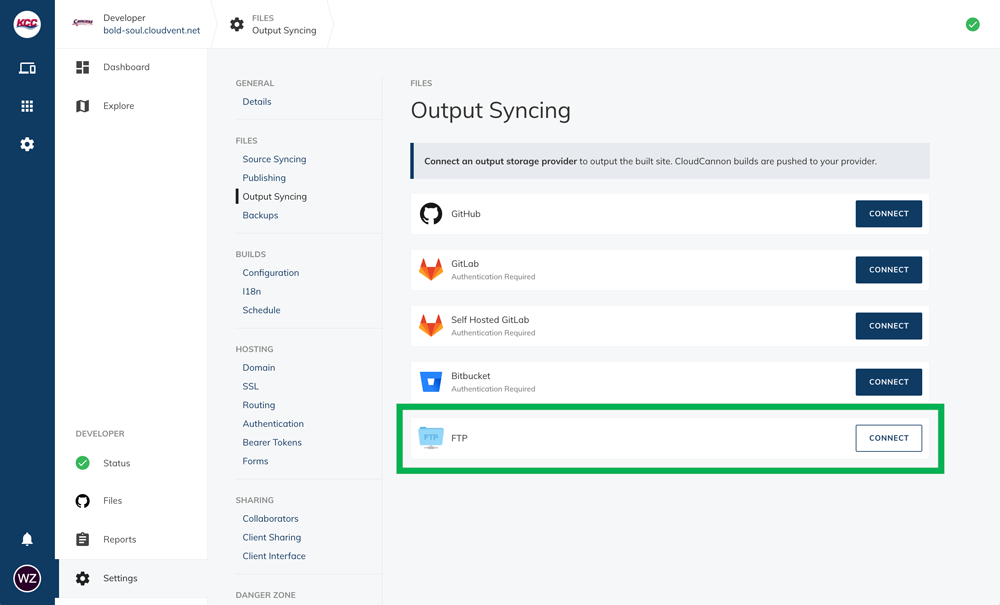
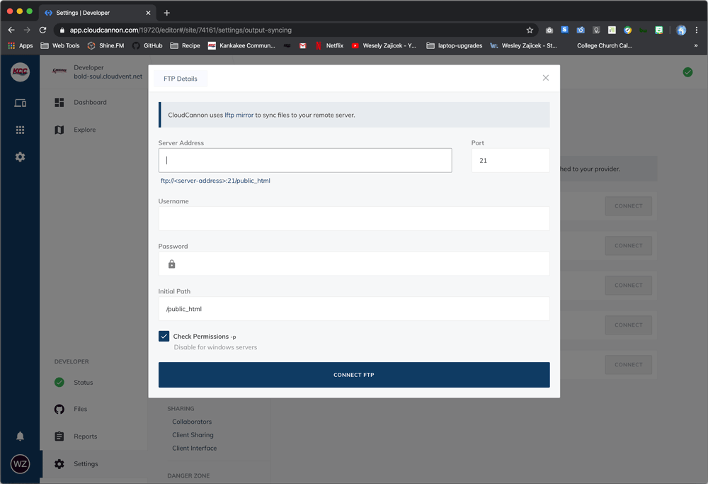
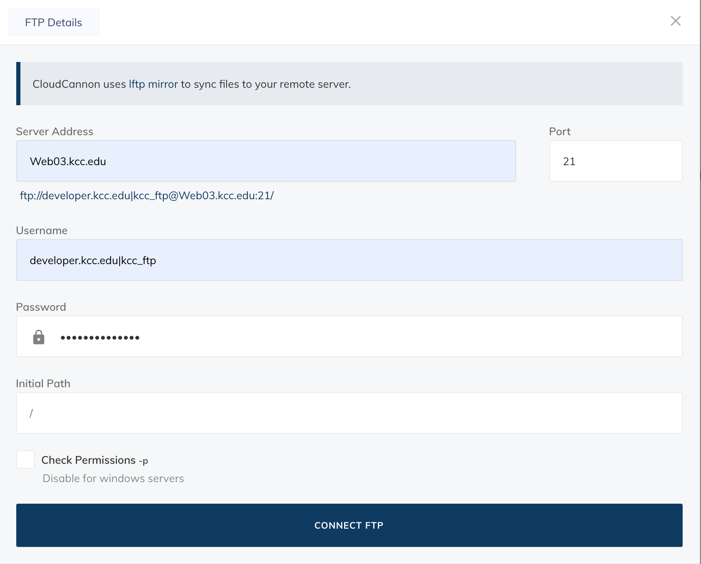
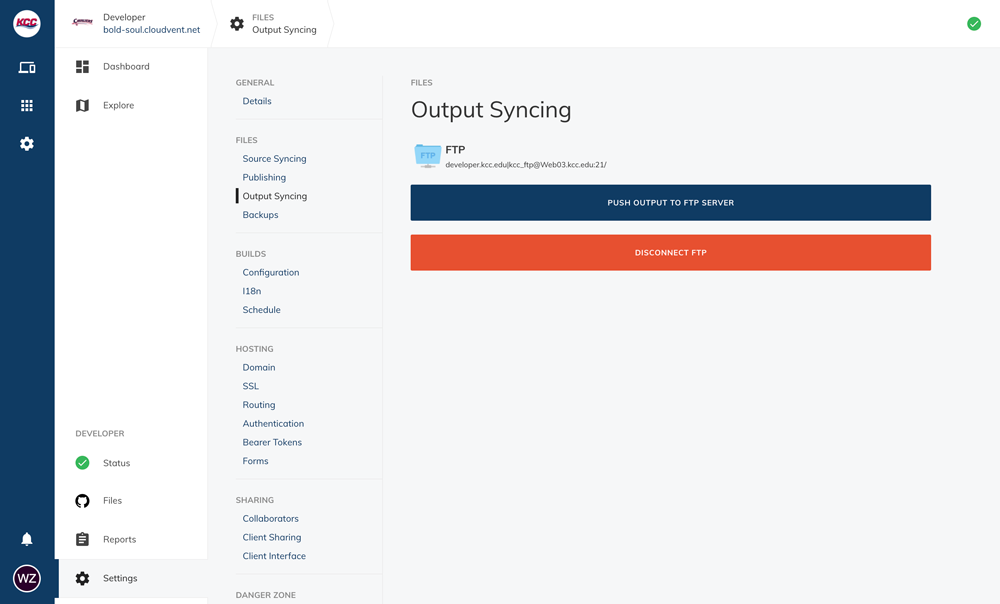
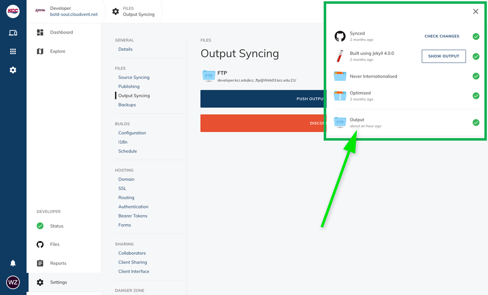

# CloudCannon FTP

KCC uses CloudCannon's FTP features to get the site files onto our `Web03.kcc.edu` server.

## FTP and Publishing Workflow Sites

Each site that uses the "Publishing Workflow", has at least three instances of the site defined in CloudCannon. Developer is not setup as a publishing workflow site, however, if it were the sites would be:

- Developer Edit (Connects to `master`)
- Developer Admin (Connects to `master` & merges into `publish`)
- Developer FTP (Connects to `publish`)

In the CloudCannon sites that use the "Publishing Workflow", **FTP Settings are only configured in the "FTP" instance of the site.**

**Some of the smaller-sites and landing pages do not use the publishing workflow** and have the FTP settings set on them directly. 

## CloudCannon FTP Settings

CloudCannon FTP settings are located within each sites' settings area. This document uses the site `developer.kcc.edu` as an example for setting up FTP in CloudCannon.

Within the general settings area of any site, FTP settings are located under the "Output Syncing" area:

### "FTP Details" Modal

Using the "CONNECT" button on "FTP" brings up a modal in which you can configure the FTP settings for your site:

### FTP Settings

Set **all** of the FTP settings to the appropriate value for the given project or site (`Port` is the only one that doesn't get changed). Refer to the list below for the values to use in each of the "FTP Details" modal's fields:

- **Server Address**: This is the same for every site, set it to: `Web03.kcc.edu`
- **Port**: Use the pre-populated default port value of `21`
- **Username**: Username consists of `<SUBDOMAIN_NAME>.kcc.edu|kcc_ftp` where `<SUBDOMAIN_NAME>` is the subdomain name, or specific folder, on `Web03.kcc.edu`
- **Password**: Use the "CloudCannon FTP password" from the place where passwords are kept.
- **Initial Path**: _The "Initial Path" field comes pre-populated with the default value of_ `/public_html`. _**Delete the value of this field** (only a_ `/` _should remain_.)
- **Check Permissions**: **Uncheck the box** for the "Check Permissions -p 'Disable for windows servers'" setting.

Lastly, use the "CONNECT FTP" button to kick-off an initial FTP and then sync any future changes.

Upon successful configuration of the FTP settings, you should see a screen like the settings bellow:

You can check the last time an FTP occurred by using the little site status dropdown from the icon in the upper-right-hand corner of the CloudCannon interface. The last item shown will report the time of the last FTP:

