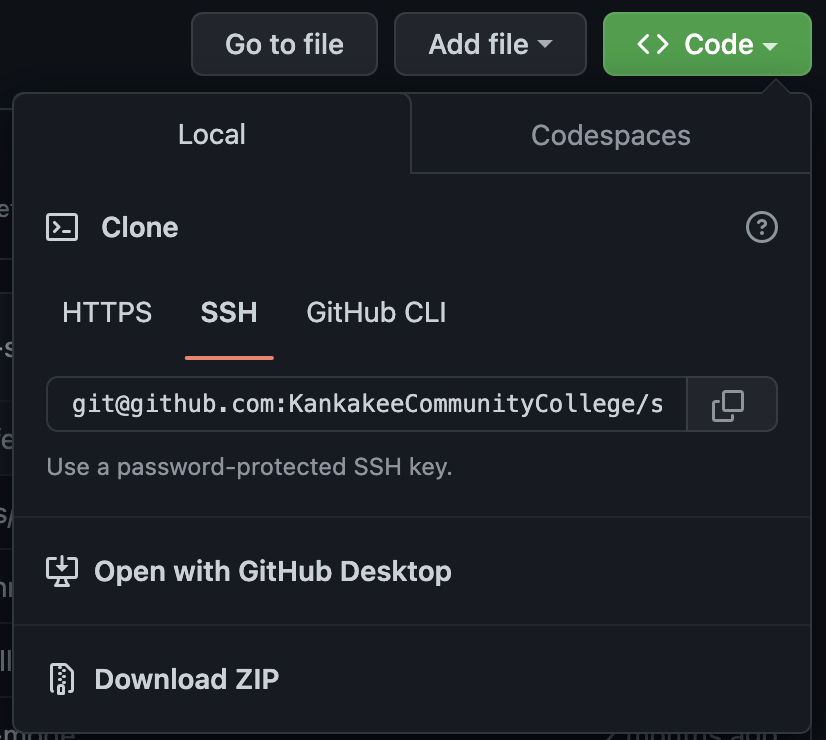

# Installing and Building a Project

> *Last updated on **11/22/2022***

- [Installing and Building a Project](#installing-and-building-a-project)
  - [Clone the Project](#clone-the-project)
  - [Install Dependencies](#install-dependencies)
  - [Running a Build](#running-a-build)
    - [Production Build](#production-build)
    - [Development Build](#development-build)
  - [Update Browserslist `caniuse` Database](#update-browserslist-caniuse-database)

-----

## Clone the Project

First you need to clone a project:

- Find the repository in GitHub
- Use the "**<> Code**" button and make sure **SSH** is selected
- Copy the Github SSH URL to your clipboard
- Clone using `git clone <clipboard-contents>`



Example using the Student Resources project:

```bash
git clone git@github.com:KankakeeCommunityCollege/student-resources.git
```

**This requires you have GitHub SSH authentication setup.**

Use following GitHub Docs to setup SSH:

- [Checking for existing SSH keys](https://docs.github.com/en/authentication/connecting-to-github-with-ssh/checking-for-existing-ssh-keys)
- [Generating a new SSH key and adding it to the ssh-agent](https://docs.github.com/en/authentication/connecting-to-github-with-ssh/generating-a-new-ssh-key-and-adding-it-to-the-ssh-agent)
- [Adding a new SSH key to your GitHub account](https://docs.github.com/en/authentication/connecting-to-github-with-ssh/adding-a-new-ssh-key-to-your-github-account)


-----

## Install Dependencies

To install the project dependencies, `cd` into the newly cloned project.

```bash
cd student-resources
```

You can install Gem and Node.js dependencies using:
```bash
bundle i && npm i
# Or
bundle install && npm install ## if you like typing more
```

-----

## Running a Build

Running a build uses `npm-run-all` to run the Webpack and Jekyll commands in parallel.

Webpack bundles any JavaScript, and consumes our SCSS files to generate our stylesheet.

Jekyll compiles the static website files using a Liquid, YAML front-matter, and HTML partials to create a template/layout system.

### Production Build

To run a production build use:

```bash
npm run production
# Or
# alias npm-p="npm run production"
npm-p ## requires an alias
```

A production build still watches for file changes and creates a local server at `localhost:3000`, to preview in your browser locally.

This means you need to stop the running commands using <kbd>control</kbd> + <kbd>C</kbd>; be sure Webpack and Jekyll have run and are idle first.

A production build creates minified and polyfilled JavaScript (determined by `browserslist` settings.) It also creates a prefixed and minified CSS file.

If you modify any SCSS or JS modules — even deleting a single space — you will have all new bundles, <abbr title="Chunks are smaller modules of JS code which get imported (dynamically) into the main bundle.">chunks</abbr>, and stylesheet files generated. This is because the filenames contain a unique hash which is computed from the bundled files.

**Be sure to `add`, `commit` and `push` *all* the new JS and CSS file changes to GitHub resulting from a production build.** **You must also include the changed `_data/hash.yml` file!** If you don't, your `<script>` and `<style>` `src` and `href` attributes will not point to the new JS and CSS filenames — breaking the site.

### Development Build

To run a development build run:
```bash
npm run development
# Or
# alias npm-d="npm run development"
npm-d ## requires an alias
```

Stop the running processes using <kbd>control</kbd> + <kbd>C</kbd>.

**Do not push a development build to GutHub!** If you do, just run a production build, and then commit and push any file changes to GitHub.

A dev build injects inline CSS into the document `<head></head>` instead of a `<link>`; this is a *Webpack* feature for more performant dev builds.

A dev build also creates a development JavaScript bundle which is not minified/uglified. It has full-length function names and other unnecessary bloat and is not suitable for production so do not push a development build back to GitHub.

You can preview the development build and see live changes by going to `localhost:3000` in your browser.

-----

## Update Browserslist `caniuse` Database

The CSS prefixing and JS polyfilling is determined from a projects `browserslist` setting (in `package.json`,) and a `caniuse` database of browser compatibility.

You should update a projects `caniuse` database often (or try to do it once a month.) Use our `npm` script to update the database:
```bash
npm run browserslist
```

You need to run a new production build after updating the `caniuse` database. Simply run a production build, stop the script (after Jekyll and Webpack are idle), and commit the new bundles, chunks, CSS, and `_data/hash.yml` files.

-----

[Back to main README](./)
