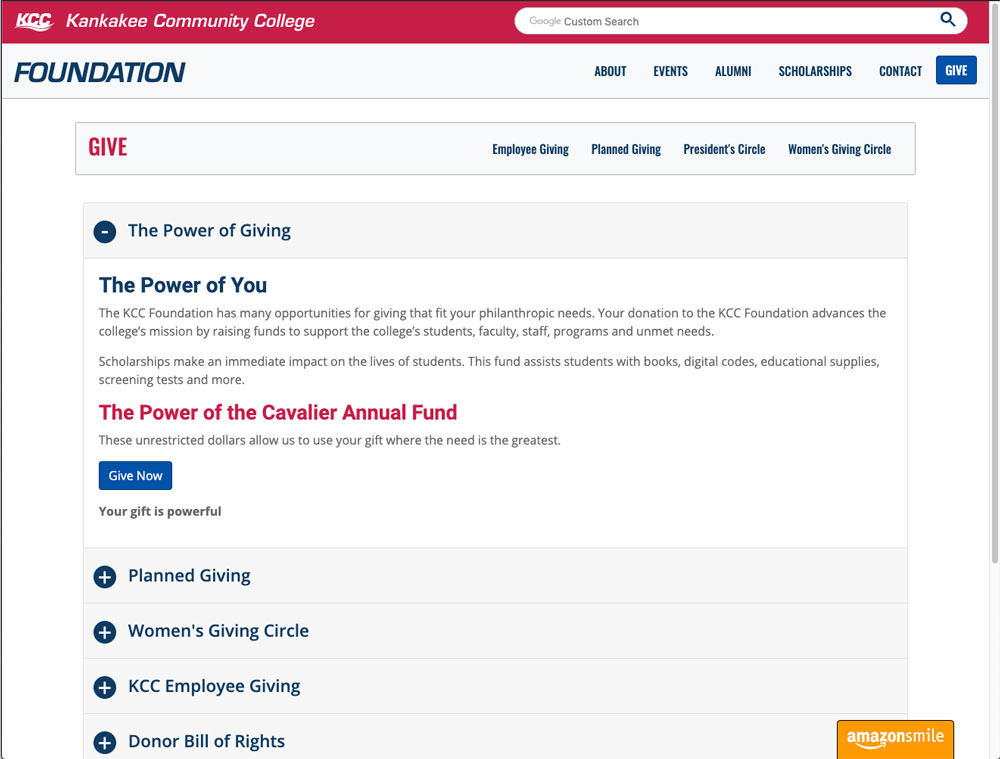

# The Accordion




```
./
|-- _includes/
|      |__ accordion.html
|-- _accordions/
|      |-- file1.md
|      |-- file2.md
|      |__ file3.md
|-- assets/
|      |-- js/
|            |__ src/
|                  |__ accordion.js
|      |__ scss/
|            |__ 2-modules/
|                  |__ _accordion.scss
|-- _config.yml
|-- gulpconfig.yml
|__ page_to_house_accordion.html
```

## Contents

- [Overview](#overview)
- [Configuration](#configuration)
  - [Jekyll `_config.yml`](#jekyll-_configyml)
  - [Gulp `gulpconfig.yml`](#gulpconfigyml)
- [Accordion Collection](#accordion-collection)
  - [Accordion Defaults File](#accordion-defaults-file)
- [Accordion Styling](#accordion-styling)
- [The Include File](#the-include-file)
- [Creating a New Accordion](#creating-a-new-accordion)


## Overview

The accordion component of the kcc-gem-theme consists of the following:
- An include file (in `_includes/`)
- Collection of markdown files (`_accordions/*.md`)
- Styling
- custom JS
- The configuration in:
  - Jekyll's `_config.yml`
  - Gulp's `gulpconfig.yml`
- A page to house the accordion


## Configuration

### Jekyll `_config.yml`

For Jekyll to process the `_accordions` collection, it has to be set as a collection in `_config.yml` under the `collections:` key:

```yaml
## _config.yml
collections:
  accordions:
    output: false
```

**If you created a new project using the `kcc-startup-template` repo in GitHub, you will not need to add this configuration, it will already be in the template's `_config.yml`**


### Gulp `gulpconfig.yml`

For Gulp to see changes in the `_accordions/` dir, it has to be configured in the gulp watch task. Our Gulp configurations are located in the `gulpconfig.yml` file:

```yaml
watch:
  pages:
    - "_accordions/*.md"
```


## Accordion Collection

The markdown files that comprise the `_accordions/` collection contain the front-matter YAML settings and content necessary to display the rendered html accordion. Each file corresponds to an accordion "card".

**The name of the markdown file is 100% irrelevant since they are not output to a file, however, a descriptive name will help in editing later.**

Bellow is an example file in Foundation's `_accordions/` collection. Each file has 3 front-matter keys:
- `accordion_page:` - The page that you want the accordion to be built into. This should be the same value as that pages' front-matter `title:` key.
- `card_heading:` - The heading/link-text the user sees on the collapsed (and expanded) accordion.
- `order:` - The display order of the accordion card in the "stack". Where The lowest number appears as the top accordion card.

```html
---
accordion_page: 'Give'
card_heading: "KCC Employee Giving"
order: 4
---

<p><strong><a href="../give/employee-giving/">KCC Employee Giving</a></strong><br />Support students in achieving their academic goals and future aspirations.</p>

```


### Accordion Defaults File

The `_accordions/` collection contains a `_defaults.md` file. This is a feature specific to CloudCannon. The `_defaults.md` file will pre-populate the front-matter fields while creating new accordion cards.

## Accordion Styling

The style rules for the accordion component are located in `./assets/scss/2-modules/_accordion.scss`. This `scss` file will get compiled, prefixed, & minified into the theme's stylesheet `assets/css/kcc-theme.css`.

All custom class names used for accordion styling start with `.accordion__*`.

## The Include File

The accordion component has an `_includes/accordion.html` file. This file gets included in the page that you want the accordion to appear in. The liquid include tags (``) should go inside a Bootstrap 4 Column as shown in the `Accordion Example Page` below:

```html
---
title: Accordion Example Page
layout: default
baseurl: ../
---

<main class="position__offset-fixed-nav">
  <div class="container">
    <div class="row">
      <div class="col">
        
      </div>
    </div>
  </div>
</main>
```


## Creating a New Accordion

1. Create the collection files. For all files in the collection, do the following:
  - Set all 3 front-matter fields to the appropriate value.
  - Add the content to the accordion bellow the front-matter delimiter (`---`). Use valid HTML, markdown, or both.
2. Add the include statement to the desired page (``) in the location you want the accordion to appear.
