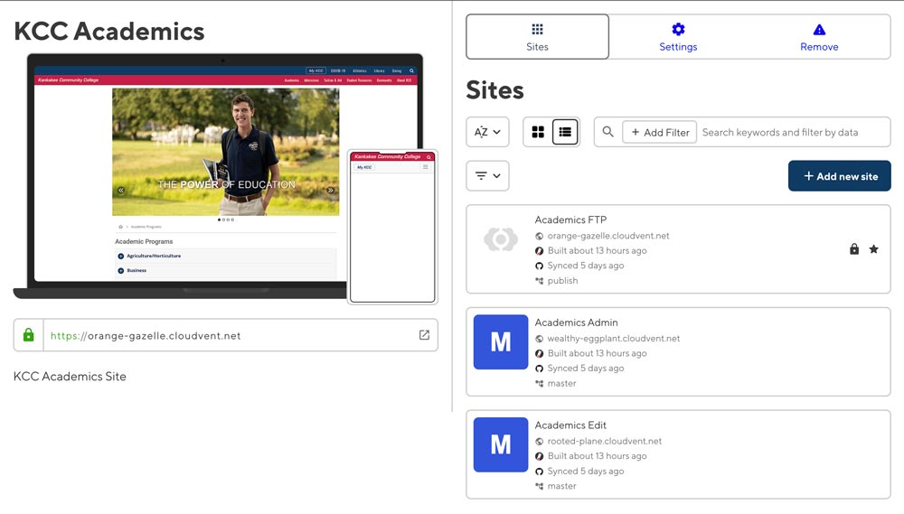
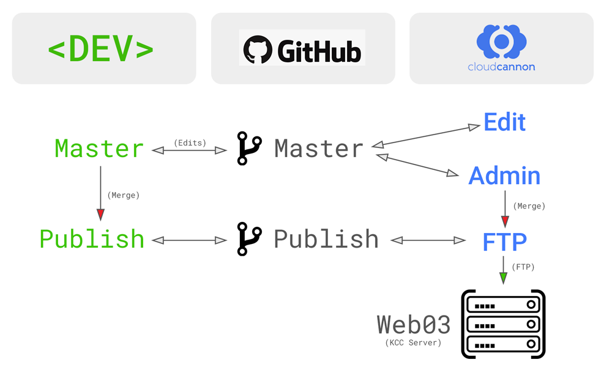

# Publishing Branch Workflow

> *Last updated on **11/28/2022***

- [Publishing Branch Workflow](#publishing-branch-workflow)
  - [Creating a `publish` branch](#creating-a-publish-branch)
  - [Developing locally](#developing-locally)

We use a `publish` branch to create a review/approval-workflow in CloudCannon.

Every project that has the publishing workflow has two main branches:
- `master`
- `publish`

The `master` branch is used to stage and preview changes. Once the edits are finalized they can be merged into the `publish` branch.

Each project has three website definitions in CloudCannon, for example **Academics Edit**, **Academics Admin**, and **Academics FTP**.

<p align="center">
  
</p>

The **Edit** and **Admin** sites sync with the `master` branch. In other words, if you make an edit using CloudCannon and save the change it will commit and push them back to the `master` branch.

The **Admin** site also has a **"Publish" button** which gives users the ability to merge the `master` branch into the `publish` branch.

The **FTP** site syncs changes with the `publish` branch. It's also setup to FTP a successful build to Web03 (which is where our website is publicly hosted.) The *FTP* sites are never used to make edits, instead **their sole purpose is to build and FTP any changes seen in the `publish` branch.**

<p align="center">
  
</p>


-----

## Creating a `publish` branch

When developing locally, you need to setup a `publish` and `master` branch on your computer. You can develop in the `master` branch or create a new branch.

After edits are finalized in `master`, they should be merged into the `publish` branch and CloudCannon will then FTP the updates to our server.

When you clone a project from GitHub you clone the `master` branch (KCC's default branch in GitHub.)

```bash
git clone git@github.com:KankakeeCommunityCollege/academics.git
cd academics
npm i && bundle i
```

Create a `publish` branch and pull:

```bash
git branch publish
git checkout publish
git pull origin publish
```

-----

## Developing locally

First, stage your edits and commit them to the `master` branch:

```bash
git add .
git commit -M "My wonderful commit message"
git push -u origin master
```

To make the edits live, you need to checkout the `publish` branch, merge the changes and push:

```bash
git checkout publish
git merge master
git push -u origin publish
```

-----

[Back to main README](https://github.com/KankakeeCommunityCollege/kcc-development-environment)

